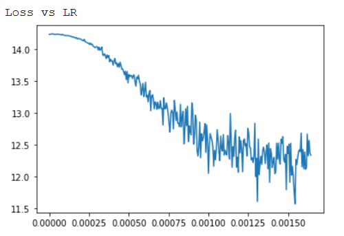

# Assignment 5

This assignment was to train a model for multi label classification with a training data of ~13000 images. There were no restrictions on using any type of model apart from using Transfer Learning.

## Approach

- A model was created from scratch for prediction.

- Since the model had to be deep `he_normal` kernel initialization was used along with L2 kernel regularizer.

- Since the model would have to be trained for a very long time and iteratively, there was a possibility to accidentally train on test data. In order to avoid this, 15% of the data was kept aside by generating and saving random numbers which would correspond to the indices of test data.

- LR Range test found out the optimal learning rate.

  

- Cutout and image augmentation was used.

## Results

`{'age_output_acc': 0.3870967741935484,
'bag_output_acc': 0.5700604838709677,
'emotion_output_acc': 0.7142137096774194,
'footwear_output_acc': 0.5292338709677419,
'gender_output_acc': 0.5866935483870968,
'image_quality_output_acc': 0.5383064516129032,
'pose_output_acc': 0.6421370967741935,
'weight_output_acc': 0.6436491935483871}`

## What did not work for me

- Changing gender to only a single representation and using binary cross- entropy.
- Changing loss weights by penalizing some classes.
- Changing some of the classes like age to labelled encoding.

## Pitfalls which I fell into

- Trained the model with `binary crossentropy` for quite sometime and improved the model only to realize that it is totally wrong to use it.
- In the beginning I had not saved the test indices and was happy with the high accuracies that came with it.
- I was monitoring the total loss for quite a long time thinking with lesser loss the accuracy would be higher. In the end realized the same and wrote a call back to calculate the average accuracy during each epoch.

## Note

- The LR Range finder code was being executed in notebook in another browser but for the same model and has not been included in this script.
- Super convergence was used for 50 epochs on the penultimate run and to try a little more luck the last run was scheduled without it. 

